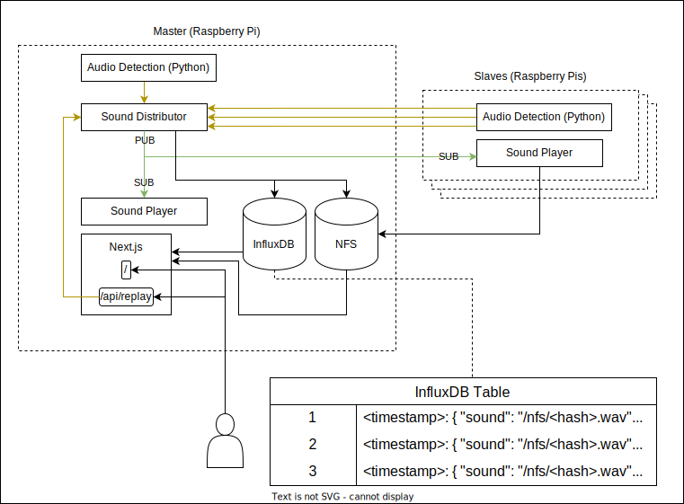

# anesowa: (A)nnoying (Ne)ighbour (So)nic (Wa)rfare

AI IoT Raspberry Pi powered solution to detect, analyse and react against discomforting
high heel sounds by projecting them back to their source.

## Motivation

My neighbour upstairs decided to walk on high heels. I expressed my discomfort and she
took it as a personal attack, rejecting all kind of mediation. Since I received insults
I decided to use the mirror strategy to see if she realizes how unpleasant it becomes:
to bounce back her sounds.

## Description

This project is composed of various pieces:

| Module               | Purpose                                                                                                            |
| -------------------- | ------------------------------------------------------------------------------------------------------------------ |
| Sound Detector       | Discriminate and pick up specific sounds using AI.                                                                 |
| Playback Distributor | Route the detected sound and bounce it back from multiple speakers on multiple locations.                          |
| Sound Player         | Play any given sound when told by the distributor.                                                                 |
| Journal (Web App)    | Visualize the sound occurrences. Useful to have an objective overview. If case gets to lawyers it might be useful. |

## Technology

This is intended to be run in a group of Raspberry Pi

| Tool                 | Purpose                                                      | Why (Reason)                                                                                                                                                                                                                                                                                                                                                                 |
| -------------------- | ------------------------------------------------------------ | ---------------------------------------------------------------------------------------------------------------------------------------------------------------------------------------------------------------------------------------------------------------------------------------------------------------------------------------------------------------------------- |
| TensorFlow (Python)  | Audio detection                                              | Provides even a higher level API (Keras) that simplifies machine learning workflows. Also provides a lightweight runtime (TF Lite) for running only inference (feeding the input and getting the output on a saved model).                                                                                                                                                   |
| Next.js (JavaScript) | Data visualization web application.                          | Allows splitting a React application between server and client components (full-stack framework), allowing you to dispatch the database queries from the server and return a rendered React component with all the data displayed, encapsulating database interaction only server-side. Allows writing REST-style API endpoints that can be listening to the sound detector. |
| InfluxDB             | Noise occurrence log.                                        | A time-series database seems very appropiate considering the nature of the data (timestamped). Chosen in favour of Prometheus because it supports `string` data types and it's PUSH-based instead of PULL-based. We don't want to lose occurrences!                                                                                                                          |
| NFS                  | Sharing a volume with the audio data.                        | The database should not get bloated with binary data. Once the audio file is producted, it gets hashed it and stored in the NFS-shared file system so it can get played by the `sound-player`.                                                                                                                                                                               |
| ZeroMQ               | Communication between audio detector and playback receivers. | Instead of having to implement an API, since it's only one instruction, it's simpler to use a PUB-SUB pipeline in the fashion of a queue. The detector places an element and all playback receivers react playing back the sound. A full queue broker installation might be overkill for a simple IoT communication channel.                                                 |
| Docker               | Containerization.                                            | Protects against underlaying operating system components that might get updated and break the app.                                                                                                                                                                                                                                                                           |
| Ansible              | Provisioning and deployment.                                 | Automates some base configuration installation on new Raspberry Pi hosts, such as the sound setup.                                                                                                                                                                                                                                                                           |

## Architecture

<picture>
  <source media="(prefers-color-scheme: dark)" srcset="./anesowa.drawio.dark.svg">
  
</picture>

## Documentation

Under each folder in this repository you will find more information about the particular
piece.

- [Sound Detector](sound-detector)
- [Sound Player](sound-detector)
- [Playback Distributor](playback-distributor)

If you are only interested in the deployment of the architecture:

| Document                                              | Explains How To...                                                                                  |
| ----------------------------------------------------- | --------------------------------------------------------------------------------------------------- |
| [Provisioning](docs/1-provisioning.md)                | Flash a new card, plug into a Raspberry Pi and provision it as **master** or **slave**              |
| [Raspberry Pi Sound Setup](docs/2-rpi-sound-setup.md) | Connect multiple Bluetooth speakers, create a combined sink of various speakers, set up microphone. |

Further information on how to get a development environment and how the issues of
running container sound on the host (be it a MacBook or a Raspberry Pi):

| Document                                                   | Explains How To...                                                                                                                                            |
| ---------------------------------------------------------- | ------------------------------------------------------------------------------------------------------------------------------------------------------------- |
| [Docker Container Sound](docs/3-docker-container-sound.md) | Offer host audio I/O to the container through PulseAudio's TCP interface.                                                                                     |
| [Development Workflow](docs/4-development-workflow.md)     | Develop the application container on a non-Pi host with keeping the LSP IDE features and still be able to use the microphone and speakers through PulseAudio. |

Other documentation:

| Document                                             | Explains How To...                                                                                      |
| ---------------------------------------------------- | ------------------------------------------------------------------------------------------------------- |
| [Stack Recipes](docs/5-stack-recipes.md)             | Run hello worlds, proof of concepts and basic examples with the stack tools: InfluxDB, NFS and Ansible. |
| [AI: Transfer Learning](docs/6-transfer-learning.md) | Repurpose an already trained classification neural network to classify specific sounds.                 |
| [Maintenance Notes](docs/7-maintenance.md)           | Keep the project up to date with the latest security and functional updates.                            |
