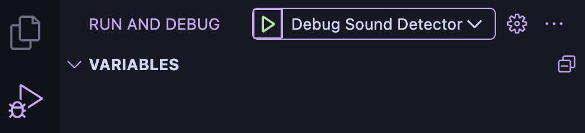
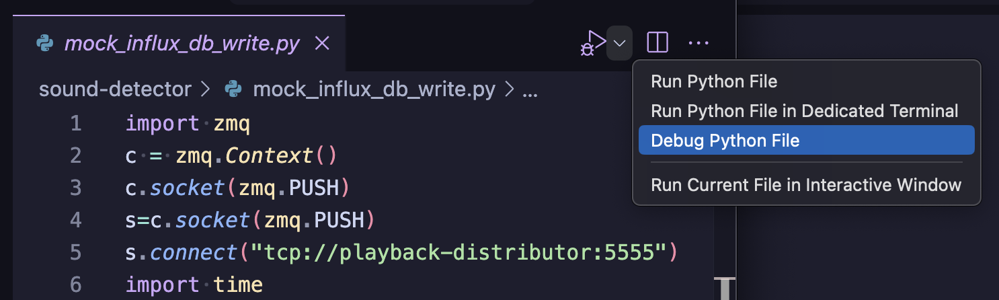
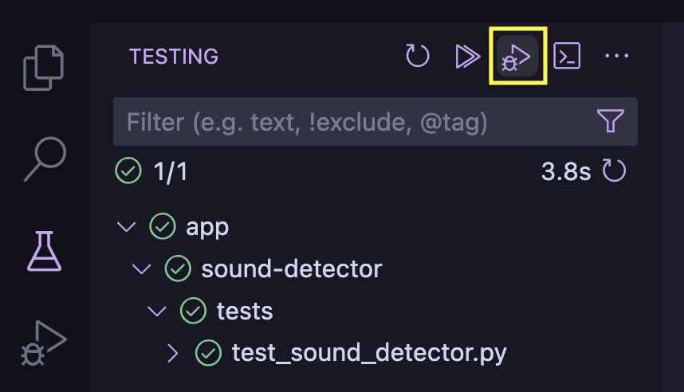
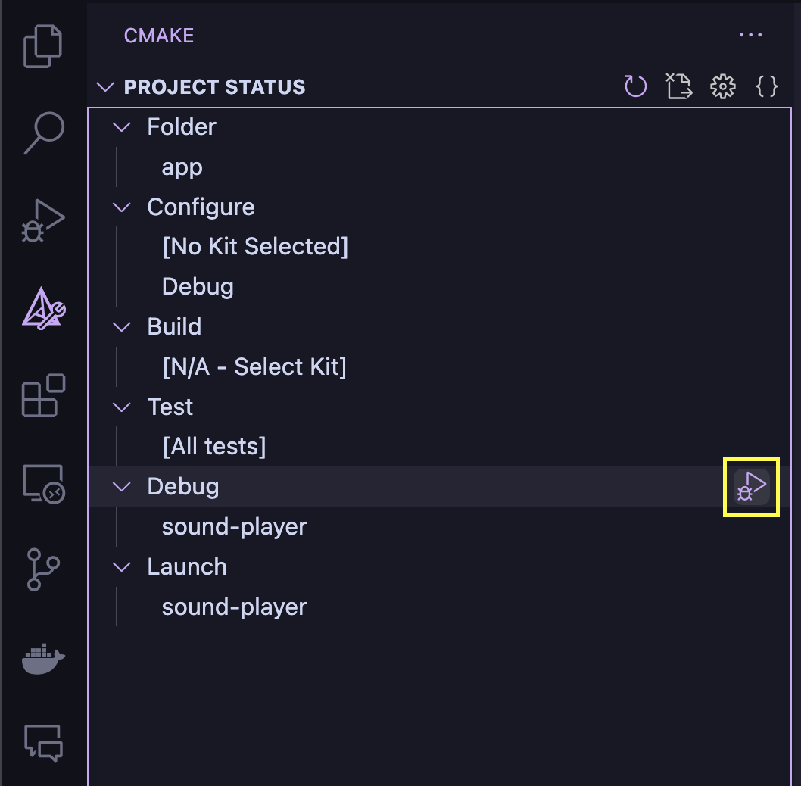
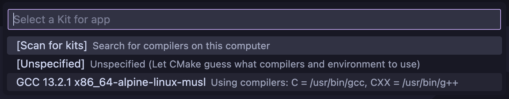
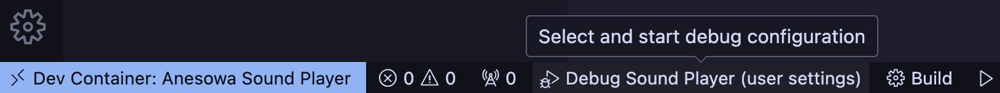
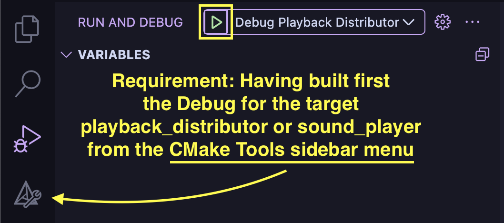

# Neovim

Coming soon!

# Visual Studio Code

Use the **Dev Containers**'s **Reopen in Container** that shows in the Commands Palette
(macOS <kbd>⌘</kbd><kbd>⇧</kbd><kbd>P</kbd>, Windows/Linux
<kbd>Ctrl</kbd><kbd>⇧</kbd><kbd>P</kbd>). and select the corresponding container:

- Sound Detector
- Playback Distributor
- Sound Player

**NOTE**: When committing your git changes do it from a window that is not running in
the container for two reasons:

1. The container might have trouble with the SSH configuration when pushing. HTTP might
   work perhaps?
2. The container does not mount everything, only specific paths, so in the eyes of git
 it would see many files disappeared!

## Python Projects: Sound Detector

In the sidebar, click **Run and Debug** (macOS <kbd>⌘</kbd> + <kbd>⇧</kbd> +
<kbd>D</kbd>, Windows/Linux <kbd>Ctrl</kbd> + <kbd>⇧</kbd> + <kbd>D</kbd>) and run the
**Debug Sound Detector** launch action. This will run the application and it will stop
at the breakpoints you set.

  

If you want a Python interpreter, on the VS Code **Terminal** run `ipython`, which has
nice features such as autocompletion, syntax highlighting, editing multi-line
statements, and more.

Other times you might want to run a single file when writing snippets of code to
integrate later on on the larger code base, for that the **Debug Python File** action at
the upper right of the code window is very helpful

  

For running the tests, under the testing sidebar icon run them as follows:

  

## C Projects: Playback Distributor & Sound Player

Run the app by heading on the **CMake Tooks** on the left sidebar and click either
**Launch** or **Debug**, the latter when if you set up some breakpoints.

  

A selector will show up asking what compiler kit do you want to use, there's only one,
which is Alpine's GCC.

  

Another handy way to debug the executable is by clicking the debug target on the footer:

  

Run the tests by clicking on **Testing** on the left sidebar and choose whether to run
them or debug them.

  

An alternative to debug the executable is to use the launch configuration provided by
clicking (in the sidebar) **Run and Debug** (macOS <kbd>⌘</kbd> + <kbd>⇧</kbd> +
<kbd>D</kbd>, Windows/Linux <kbd>Ctrl</kbd> + <kbd>⇧</kbd> + <kbd>D</kbd>) and runing
the **Debug Sound Distributor/Player** launch action, but for this you must have run
first the Debug build with the CMake Tools as explained above.

  

